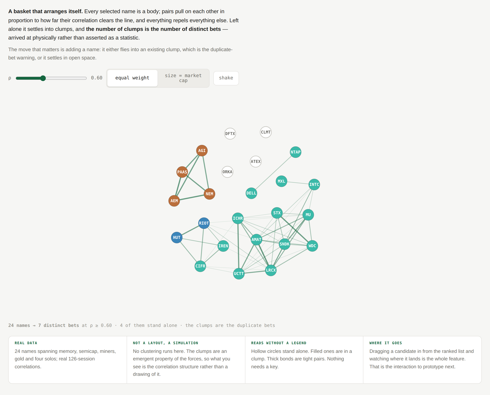

# Gravity Basket

**Understand selected names and duplicate bets.** A basket that arranges itself,
so the number of bets you actually hold is something you count rather than
something you are told.

**Provenance** · drawn against snapshot `2026-08-28` (`dataHash 7e355cdc75ed19b0`), product at main `b342414`. Ranks, correlation groups and the 126-session correlation window are all from that snapshot; if any of those change, re-read *What it communicates* before trusting the numbers below.

---

## What the user sees

An open field with your selected names as circles, drifting until they settle.

- Every pair whose correlation clears the threshold is **bonded** — a line whose
  thickness and opacity rise with how far above the line the pair sits.
- Bonded pairs **pull together**; everything repels everything else. The basket
  settles into clumps with clear space between them.
- A name in a clump is a **filled** circle in its sector hue. A name bonded to
  nothing is **hollow**, outlined only. That is the entire legend, and it is not
  written down anywhere.
- One line underneath: **"24 names → 7 distinct bets at ρ ≥ 0.60 · 4 of them
  stand alone."**

In the prototype's 24-name basket the gold names (AEM, NEM, PAAS, AGI) settle as
their own tight triangle, memory and semicap and the crypto miners fuse into one
large mass at ρ 0.60, DELL·NTAP sit as an isolated pair, and ATEX, DFTX, ORKA and
CLMT float alone.

## What it communicates

That a basket of twenty-four names is not twenty-four bets, expressed as a shape
instead of a statistic. The current watchlist says *"11 of your 15 names sit in 4
groups"*, which is true and correct and does not land. Seven separated clumps on
a screen lands.

It also carries something a group list cannot: **how tightly** each clump holds,
in the visible density of its bonds, and **which clumps are nearly touching** —
the pairs that would merge at a slightly lower threshold.

## Prototype

Ran at `lab/field/#basket`. Real 126-session correlations over 24 names spanning
memory, semicap, crypto miners, gold and four unrelated solos.

## Interaction and motion

**Motion is not decoration here — it is the whole mechanism.** The clumps are not
computed and drawn; they emerge from the forces, so what you see is the
correlation structure rather than a picture of it.

- **Threshold slider** changes the physics. Bonds break, clumps split and drift
  apart, and the distinct-bet count rises as you watch. At ρ 0.60 the miners and
  the semis are one mass; raising it separates them.
- **Shake** re-seeds positions and lets it re-settle, which shows the layout is
  not arbitrary — it converges to the same structure from a different start.
- **Size toggle** between equal weight and market cap.
- **The move that matters, and is not yet built:** dragging a candidate in from
  the ranked list. It either flies into an existing clump — that is the
  duplicate-bet warning, delivered physically — or it settles in open space,
  which is the only visual this product has ever had for *"this one is actually
  new"*. Prototype that next.
- Respect `prefers-reduced-motion`: settle the simulation in a loop and paint the
  final state once.

## Data required

**Nothing new.** Correlation-grade returns are already fetched per selected name,
and the pairwise correlations are the same figures the watchlist already computes
on device.

The prototype precomputes its matrix at build time only because the lab is
static; in the product this is the existing watchlist calculation.

## Why it is worth preserving

It converts the product's core risk statement from a sentence into a physical
arrangement, and it is the only concept in the library where **the interaction
carries the insight** rather than the still image. A screenshot of it is the
weakest version of it.

**The honest counter-argument:** force layouts are unstable and non-deterministic
in a product built on byte-identical reproducibility. Two runs settle to the same
*structure* but not the same *picture*, and this repo cares about that
distinction more than most. If it graduates, the layout probably needs a
deterministic seed and a fixed iteration count — settle it, then stop.
