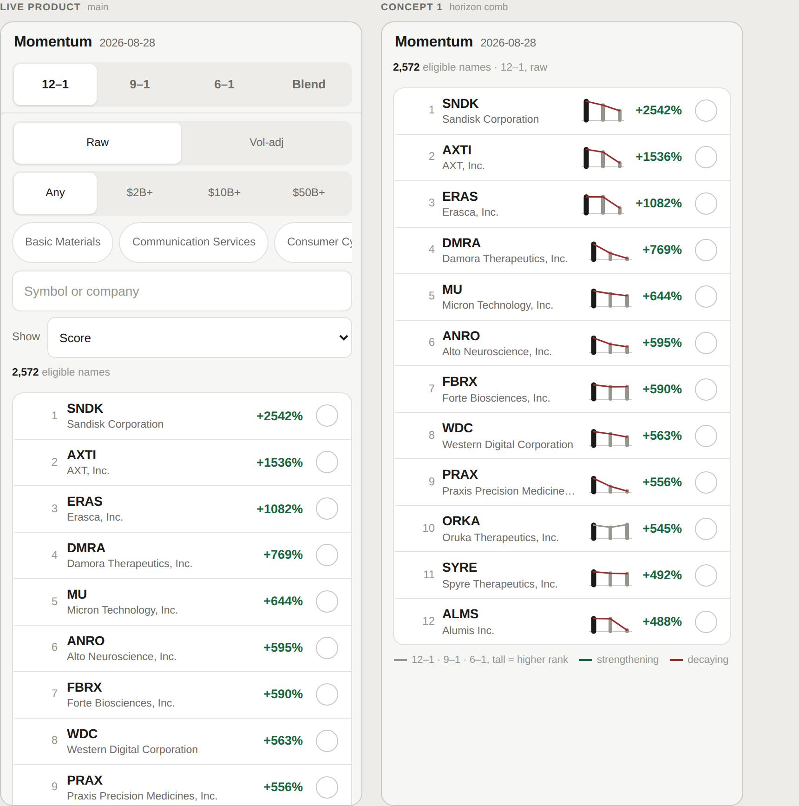

# Horizon Comb

**Understand one ranked name across momentum horizons.** A glyph the size of a
number, carrying the shape of a name's standing over all three windows.

**Provenance** · drawn against snapshot `2026-08-28` (`dataHash 7e355cdc75ed19b0`), product at main `b342414`. Ranks, correlation groups and the 126-session correlation window are all from that snapshot; if any of those change, re-read *What it communicates* before trusting the numbers below.

---

## What the user sees

A 54×26px mark sitting in the ranked row, between the company name and the value.

- **Three teeth**, left to right: 12–1, 9–1, 6–1. Long window to short window,
  which reads as older to newer.
- **Tooth height is rank on a log axis.** Log, not percentile — at 2,572 names a
  linear percentile puts #1 and #100 within 3.8% of the axis and every comb in
  the part of the list anyone reads flattens into the same rectangle. This was
  built the wrong way first.
- A **spine** joins the tips: green where the short window is stronger than the
  long one, red where it is weaker, grey where neither. The threshold is judged
  on the same log axis, so it is scale-free — a 20-place move at the front counts
  and the same 20 places at #1,500 does not.
- The tooth for the horizon currently being viewed is **heavier**, which ties the
  glyph to the tab you are on.

Silhouettes read before any digit does. Flat top = led all year. Staircase down =
a leader dying. Staircase up = arriving.

## What it communicates

Rank in three nested windows, and the direction of travel between them, in the
footprint of a percentage. The three horizons are already a time axis; the
product has one but does not draw it.

On the product's own default view it changes the conclusion:

```
rank sym     12–1    9–1    6–1
   1 SNDK       1      5     54
   4 DMRA       4    200   1644
   9 PRAX       9    263   1947
  12 ALMS      12     13   1693
  20 BW        20    316   1267

of the top 20 on 12–1 raw: 18 decaying, 1 flat, 1 rising
```

Eighteen of the twenty names on the first screen have momentum that has already
rolled over. Some of that is structural — 12–1 is the longest window, so its
leaders are long-run winners by construction — but #4 sitting at #1,644 over six
months is not structural. Those figures are already on the row. The screen spends
the row on a column of large green percentages instead.

## Prototype



Ran at `lab/#comb`, live product in the left pane for comparison. Inline SVG,
five elements per row, built in the same loop that builds the row.

## Interaction and motion

- **Switching raw ↔ vol-adjusted animates every tooth to its new height** over
  ~420ms with slight overshoot. The volatility charge stops being a toggle and
  becomes something you watch happen, name by name, down the list.
- The glyph is not itself a tap target; the row already is.
- No hover state — this is phone-first, and the glyph has to work with nothing
  but a glance.

## Data required

**Nothing new.** Per-horizon ranks come from the product's own `scoresFor()` +
`ranksFor()`.

One trap, recorded because it cost a day: **do not rank single horizons on the
stored z-scores.** `README.md` says normalisation is monotonic and so does not
reorder a single horizon. Winsorising is not monotonic — clipping at the 1st/99th
percentile ties 26 names at each tail, and the symbol tie-break then alphabetises
them. Measured, that disagrees with the shipped ranking on 1,085 of 15,432 rank
cells, and the tie is ranks #1–#26 of the default view. See
`notes/winsorised-ranks.md`.

## Why it is worth preserving

It is the smallest concept in the library and the only one that fits in the
product as it exists, unchanged. It also produced the single most useful finding
of the whole exploration — that the default screen's top twenty is mostly names
on the way down — and it produced it as a side effect of drawing, not analysis.

**The honest counter-argument:** it competes for space with the number the row
already shows, on a 390px screen where the company name already truncates. The
open question is whether it sits beside the metric or replaces it, and that is a
real trade rather than a detail. It is also the concept most exposed to the
product's evolution: it depends on there being exactly three horizons.
