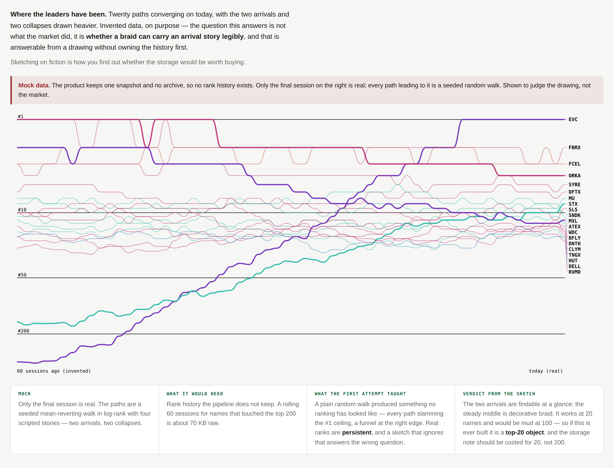

# Rank River

**Understand rank movement through time.** A braid of paths converging on today.

> **This is the only packet in the library drawn on invented data**, and that is
> deliberate. See *Data required*.

**Provenance** · drawn against snapshot `2026-08-28` (`dataHash 7e355cdc75ed19b0`), product at main `b342414`. Ranks, correlation groups and the 126-session correlation window are all from that snapshot; if any of those change, re-read *What it communicates* before trusting the numbers below.

---

## What the user sees

Twenty paths sweeping left to right across the frame, all arriving at today's
ranking on the right edge, labelled.

- **Vertical position is rank on a log axis**, so the top of the list has room
  and #400 does not consume half the frame.
- **Colour is sector.** Paths are drawn as smooth béziers, not polylines.
- **Two arrivals and two collapses are drawn heavy**; the rest are thin. The
  question the drawing is testing is whether a story is findable in a braid at
  all, so the stories are marked and everything else is context.
- Labels on the right are decluttered — twenty names converging on the top of a
  log axis put half of them inside twenty pixels otherwise.
- A red-flagged banner above the drawing states plainly that the paths are
  invented.

## What it communicates

Whether the leaders arrived recently or have been there all along — the single
question the product cannot currently answer at all, because it has no yesterday.

The finding from the sketch is about **the drawing, not the market**: the two
arrivals are findable at a glance, and the steady middle is decorative braid.
It works at twenty names and would be mud at a hundred.

That changes the storage question. If a rank river is ever built it is a
**top-20 object**, so the history should be costed for twenty names, not two
hundred.

## Prototype

Ran at `lab/field/#river`. Sixty sessions, twenty names.

## Interaction and motion

- Static as prototyped. The obvious motion is a **scrubber** — dragging back
  through the sessions and watching the ranked list itself reorder, with the
  river as the map of where you are.
- Hovering a path should isolate it and drop the rest to a whisper; twenty
  overlapping béziers need a way to pull one out.
- A **"since"** control (a week, a month, a quarter) matters more than a
  continuous scrub, because the questions people actually ask are anchored to
  round periods.

## Data required

**Rank history the product does not keep, and has deliberately chosen not to.**

The pipeline overwrites `web/data/snapshot.json` on every weekday run and keeps
no archive; the dated whole-snapshot archive was dropped in the ranker reshape as
387 KB/day for no consumer. Git holds three commits touching the snapshot and all
are schema changes, so there is no recoverable history either. The browser has
today and no yesterday.

Cost of the smallest useful version, computed rather than guessed — two bytes per
name-session with a 64-character alphabet at two characters per day:

| window | every eligible name | names that touched the top 200 (~600) |
|---|---|---|
| 20 sessions | 100 KB | 23 KB |
| 60 sessions | 301 KB | 70 KB |
| 120 sessions | 603 KB | 141 KB |

Against a snapshot that is 381 KB raw. **Compressed figures are deliberately
absent** — rank history compresses according to how much the ranking churns day
to day, which cannot be measured from a single snapshot. Full note in
`notes/rank-history-cost.md`.

**What the invented data is:** a seeded mean-reverting walk in log-rank with four
scripted stories, anchored so the final session is the real ranking. The first
attempt was a plain random walk and produced something no ranking has ever looked
like — every path slamming the #1 ceiling, a converging funnel at the right edge.
Real ranks are persistent, and a sketch that ignores that answers the wrong
question.

## Why it is worth preserving

It is the proof that sketching on fiction is not a compromise. Drawing this
answered a real question — *is a braid legible, and at what size* — and the
answer changed the cost estimate for the feature by an order of magnitude, all
before anyone stored a single byte.

Preserve the method as much as the picture.

**The honest counter-argument:** it is the only concept here that cannot be
built at all today, and the storage it needs is something the product removed on
purpose. It should stay a sketch until someone wants the history for a second
reason.
