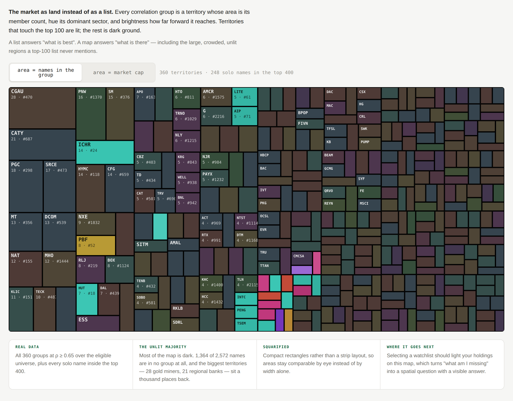

# Territories

**Understand the universe.** The market as land you look at, rather than a list
you scroll.

**Provenance** · drawn against snapshot `2026-08-28` (`dataHash 7e355cdc75ed19b0`), product at main `b342414`. Ranks, correlation groups and the 126-session correlation window are all from that snapshot; if any of those change, re-read *What it communicates* before trusting the numbers below.

---

## What the user sees

A single dense rectangle filling the screen, tiled edge to edge with no gaps.
Every tile is one correlation group.

- **Area** is how many names are in the group.
- **Hue** is its dominant sector.
- **Lightness** is how far forward it reaches — a group whose best member is #24
  is bright, one whose best is #1,400 is nearly black.
- **Lit or unlit**: any group with a member inside the top 100 is saturated;
  everything else is dark ground.
- Tiles above roughly 52×26px carry their best member's ticker, the member count
  and the best rank. Below that they are silent shapes, which is correct — they
  are texture, not entries.

Laid out squarified, so tiles stay compact rectangles and areas are comparable by
eye rather than by width alone.

The overwhelming visual impression is **darkness**. Most of the map is unlit.

## What it communicates

The current product ranks names and shows the best ones. It has no way to
describe the market those names sit in. This does, and the answer is not what
the list implies:

| | |
|---|---|
| lit and small | 14 semicap names reaching #24 · 7 miners reaching #18 |
| dark and enormous | 28 gold miners, best rank #470 · 21 regional banks, best #687 |
| not on the map at all | 1,364 of 2,572 names are in no group |

So the biggest, most internally coherent structures in this market are nowhere
near the top of the ranking, and a top-100 list can never say so. It inverts the
question from *what is best* to *what is there*.

## Prototype

Ran at `lab/field/#terr`. Canvas, squarified treemap, hover reads out the full
member list.

## Interaction and motion

- **Hover** reads out the whole group: members, size, best rank, sector.
- **Area toggle** switches between member count and total market cap. The map
  visibly reorganises — the gold territory shrinks and the mega-cap technology
  tiles swell — which is a second reading of the same structure.
- Not built, and the obvious next move: **selecting a watchlist should light your
  holdings on the map.** That turns "am I concentrated" into a spatial question
  and, more usefully, exposes the inverse — the large territories you have no
  exposure to at all.
- Motion worth having: a transition rather than a redraw when the area basis
  changes, so tiles are seen to grow and shrink rather than being replaced.

## Data required

**Everything it needs already exists.** Cluster ids over the whole eligible
universe at each threshold, sector, market cap and rank — all in the snapshot and
already parsed on boot.

Nothing new is required for the drawing as prototyped. Lighting a watchlist on it
also needs nothing new, since selection is already local state.

## Why it is worth preserving

It is the only drawing that made the product's central blind spot obvious, and it
did so without being asked to. Two other concepts independently found the same
fact afterwards; this one found it first and states it most directly.

**The honest counter-argument:** it is a desktop-shaped picture. At 390px a
treemap of 360 tiles is unreadable, and this product is phone-first. The phone
version is probably not this map — it may be a single line of text derived from
it. Preserve the *finding* and the encoding; do not assume the rectangle
survives contact with a phone.
