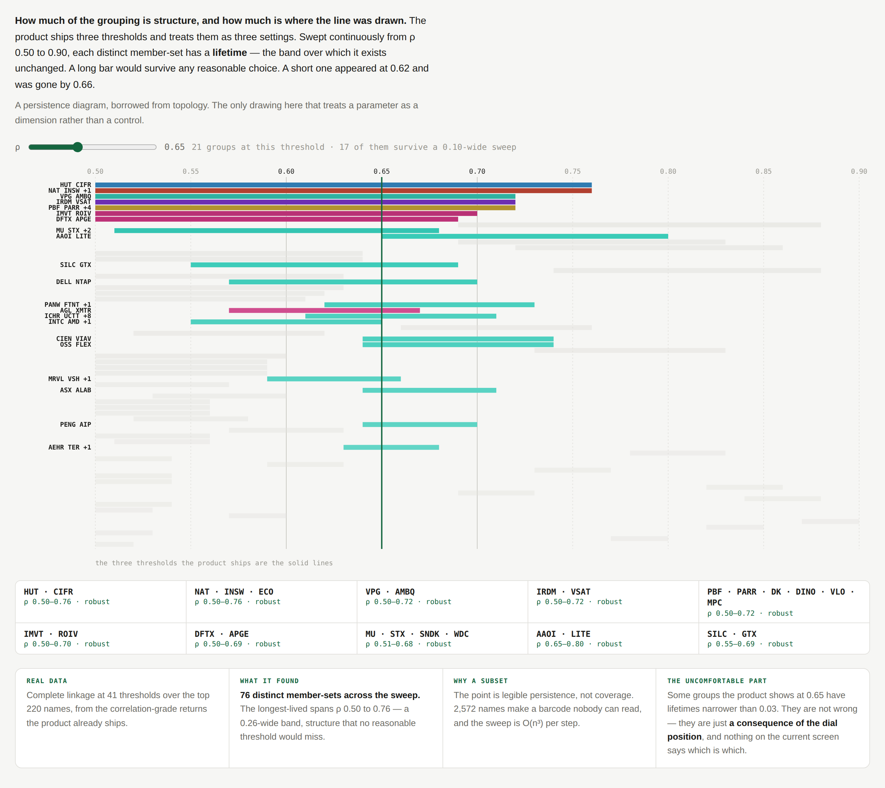

# Threshold Dial

**Understand the robustness of correlation groups.** How much of the grouping is
structure, and how much is where the line happened to be drawn.

**Provenance** · drawn against snapshot `2026-08-28` (`dataHash 7e355cdc75ed19b0`), product at main `b342414`. Ranks, correlation groups and the 126-session correlation window are all from that snapshot; if any of those change, re-read *What it communicates* before trusting the numbers below.

---

## What the user sees

A barcode. One horizontal bar per distinct group, on a horizontal axis of ρ from
0.50 to 0.90.

- A bar spans **the band of ρ over which that exact member-set exists unchanged**
  — its lifetime. A long bar is a group that would survive any reasonable choice
  of threshold. A short bar appeared at 0.62 and was gone by 0.66.
- **The three thresholds the product ships are drawn as solid vertical rules**,
  so you can see how much of what the product shows is a consequence of standing
  at 0.65 rather than 0.64.
- A **draggable vertical line** is the dial itself. Bars alive under it are
  saturated in their sector hue and labelled; everything else is a pale ghost,
  present as context and deliberately unlabelled — seventy-six labels in 600px
  collide into a grey smear.
- Below, the groups alive at the current threshold with their lifetime, each
  marked robust or fragile.

Sorted by lifetime, so the durable structure is at the top and the artefacts sink.

## What it communicates

That a threshold is a **dimension**, not a setting. This is the only drawing in
the library that treats a parameter that way, and it is borrowed wholesale from
persistence diagrams in topology.

From the real sweep over the top 220 names, 41 thresholds, complete linkage:

| group | lifetime | |
|---|---|---|
| `HUT · CIFR` | ρ 0.50 – 0.76 | crypto miners, survives everything |
| `NAT · INSW · ECO` | ρ 0.50 – 0.76 | tankers |
| `MU · STX · SNDK · WDC` | ρ 0.51 – 0.68 | storage, robust |
| `AAOI · LITE` | ρ 0.65 – 0.80 | optical, exists only above 0.65 |

**76 distinct member-sets across the sweep.** At ρ 0.65 the product shows 21
groups; 17 of them survive a 0.10-wide band and the rest do not.

The uncomfortable part is the useful part: some groups on the current screen have
lifetimes narrower than 0.03. They are not wrong — they are a consequence of the
dial position — and nothing in the product distinguishes them from the ones that
would survive any choice.

## Prototype

Ran at `lab/field/#dial`.

## Interaction and motion

- **Dragging the dial** is the whole interaction. Bars light and extinguish as it
  passes; the list beneath rewrites live. What you are watching for is not a
  number but which bars stay lit across a wide drag.
- Not built: **snapping** the dial to the three shipped thresholds, so the
  product's own settings are felt as detents on a continuum rather than as three
  buttons.
- Not built, and better: hovering a bar should light its members everywhere else
  on screen — the ranked list, the territories map, the basket.
- Motion should be immediate, not eased. This is a scrub, and lag reads as lag.

## Data required

**Nothing new for the drawing** — complete linkage over correlation-grade returns
is exactly what the pipeline already does, just run at 41 thresholds instead of 3.

**But not for free at runtime.** The sweep is O(n³) per step, so the prototype
precomputes it at build time over the top 220 names. Shipping it means either a
new small pipeline output (lifetimes per group, which is tiny) or restricting the
live sweep to a selection — which is probably the better product anyway, since
robustness matters most for names you hold.

Using a subset is not only a performance compromise: 2,572 names make a barcode
nobody can read, and legible persistence is the entire point.

## Why it is worth preserving

It asks a question nobody has asked of this product: **how much should you trust
the grouping?** Everything else in the library takes the groups as given. This
one interrogates them, and finds that most of them hold up and a minority
visibly do not.

It is also the cheapest honest upgrade available to the existing UI. Even without
the barcode, a single word — *robust* or *fragile* — beside each group on the
watchlist would carry most of the value, and the lifetimes it needs are small
enough to precompute.

**The honest counter-argument:** it is an analyst's instrument, not a phone
screen. A barcode of 64 bars is a desktop object, and the product is deliberately
"a few steps above a nice spreadsheet" rather than a research terminal. The
version that ships is probably the one word, not the picture — but the picture is
how you find out the word is worth saying.
